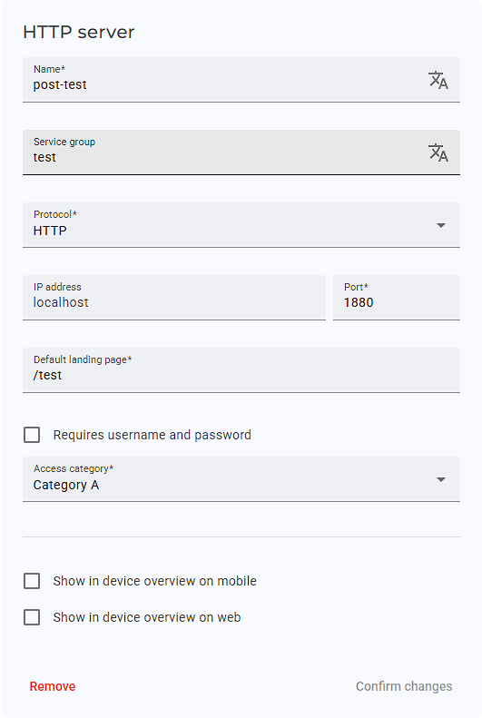
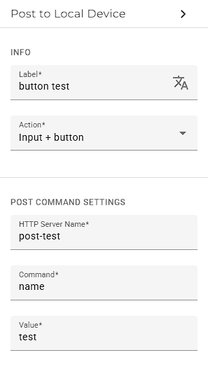
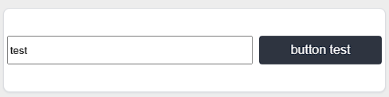
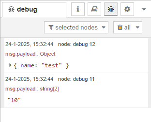

# Post to local device with Node-Red webserver example

First of all setup your Node-Red system with the example flow.
This will setup a webserver on your Node-Red system with the landing page: `http://<IPADDRESS>:<PORT>/test`

In the example there is also a way to manipulate the data in Node-Red.
When sending the name: `test`, it will be changed to the value: `10`

When your webserver is running, we have to setup the Web access within the IXON Cloud Platform.

Go to the Fleetmanager and setup the HTTP service to your Node-Red webserver ( e.g. `http://<IPADDRESS>:<PORT>/test` )

## Example:

When you setup the Fleetmanager, we can setup the component in the studio.

The result in the portal will look like this:

When we send out the command, we will receive the following message within our Node-Red system:

--- 

As this is just en example in Node-Red, you could use this information to write to your PLC with other nodes within Node-Red.
Have a look at our example for the Secure-Edge PRO, to write data to an OPC-UA server.
[Secure-Edge PRO OPC-UA server example](https://github.com/ixoncloud/edge-app-node-red-opc-ua-ixon-cloud)
